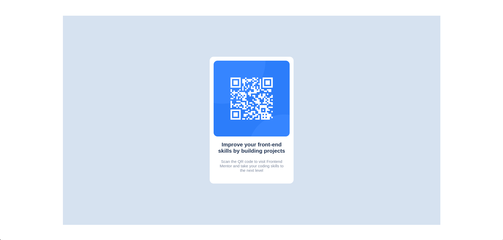

# Frontend Mentor - QR code component solution

This is a solution to the [QR code component challenge on Frontend Mentor](https://www.frontendmentor.io/challenges/qr-code-component-iux_sIO_H). Frontend Mentor challenges help you improve your coding skills by building realistic projects.

## Table of contents

- [Overview](#overview)
  - [Screenshot](#screenshot)
  - [Links](#links)
- [My process](#my-process)
  - [Built with](#built-with)
  - [What I learned](#what-i-learned)
  - [Continued development](#continued-development)
  - [Useful resources](#useful-resources)
- [Author](#author)
- [Acknowledgments](#acknowledgments)

## Overview

### Screenshot

### Links

- Solution URL: [FM solution](https://www.frontendmentor.io/solutions/basic-html-and-css-ewAPZFOARc)
- Live Site URL: [GithubPages](https://wanderstweek.github.io/qr-code/)

## My process

### Built with

- HTML
- CSS
- Mobile-first workflow

### What I learned

Since I have some very basic expirience with HTML & CSS, this project was relativly easy for me to build. With this project I mostly learned how to push project to GitHub repository and how to publish project on GitHub Pages.

### Continued development

My plan is to continue with the challenges from FrontendMentor. This is only the beggining and I'm very exited to continue learning. For now, only HTML & CSS....

### Useful resources

- [w3schools](https://www.w3schools.com) - I use this site as a starting point for learning the basics. Not only HTML and CSS but for SQL, Python and JavaScript.  

## Author

- Website - [wanderstweek](https://wanderstweek.github.io/qr-code/)
- Frontend Mentor - [@wanderstweek](https://www.frontendmentor.io/profile/wanderstweek)

## Acknowledgments

Thanks, brain..! I love you!
